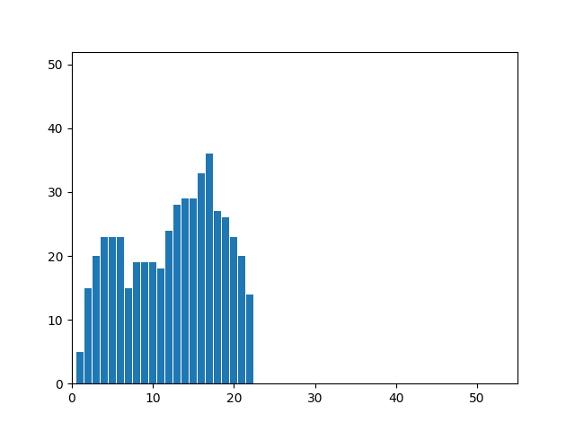

# laba5
# Лабораторная работа №5. Выделение признаков символов.
Лабораторная работа проделывалась на грузинском алфавите. Тип букв -- обычные прописные,
шрифт bpg_nino_mtavruli_bold, размер 52. В качестве демонстрации были выбраны 
4 символа, представляющих собой наибольший интерес. Квадраты для рассчета веса черного расположены
следующим образом:

## Символ ბ (Бани)
Прямое и инвертированное сгенерированные изображения:

Профили буквы:

Признаки:
1. Вес первого квадрата: 97
2. Нормированный(на четверть площади) вес черного: 0.4532710280373832
3. Вес второго квадрата: 82
4. Нормированный(на четверть площади) вес черного: 0.38317757009345793
5. Вес третьего квадрата: 125
6. Нормированный(на четверть площади) вес черного: 0.5841121495327103
7. Вес четвертого квадрата: 122
8. Нормированный(на четверть площади) вес черного: 0.5700934579439252
9. Центр масс: (21.06, 10.19)
10. Нормированный центр масс: (0.52, 0.43)
11. Моменты инерции: (15536.0399061033, 46719.28873239415)
12. Нормированные моменты инерции: (0.08560933625439893,0.25744059122084545)

## Символ რ (Сани)
Прямое и инвертированное сгенерированные изображения:

Профили буквы:

Признаки:
1. Вес первого квадрата: 186
2. Нормированный(на четверть площади) вес черного: 0.5299145299145299
3. Вес второго квадрата: 143
4. Нормированный(на четверть площади) вес черного: 0.4074074074074074
5. Вес третьего квадрата: 156
6. Нормированный(на четверть площади) вес черного: 0.4444444444444444
7. Вес четвертого квадрата: 151
8. Нормированный(на четверть площади) вес черного: 0.4301994301994302
9. Центр масс: (18.867924528301888,16.586477987421382)
10. Нормированный центр масс: (0.47020854021847075,0.44532794249775376)
11. Моменты инерции: (70226.24371069181,63354.90566037791)
12. Нормированные моменты инерции: (0.17361418582802254,0.15662677915326212)

## Символ ჭ (Чари)
Прямое и инвертированное сгенерированные изображения:

Профили буквы:

Признаки:
1. Вес первого квадрата: 94
2. Нормированный(на четверть площади) вес черного: 0.4392523364485981
3. Вес второго квадрата: 154
4. Нормированный(на четверть площади) вес черного: 0.719626168224299
5. Вес третьего квадрата: 105
6. Нормированный(на четверть площади) вес черного: 0.49065420560747663
7. Вес четвертого квадрата: 135
8. Нормированный(на четверть площади) вес черного: 0.6308411214953271
9. Центр масс: (19.483606557377048,11.41188524590164)
10. Нормированный центр масс: (0.4864106988783434,0.4958040593286495)
11. Моменты инерции: (16584.21106557376,58193.868852459134)
12. Нормированные моменты инерции: (0.06963942432130879,0.2443642033914738)

## Символ ჰ (Хаэ)
Прямое и инвертированное сгенерированные изображения:

Профили буквы:

Признаки:
1. Вес первого квадрата: 52
2. Нормированный(на четверть площади) вес черного: 0.24299065420560748
3. Вес второго квадрата: 126
4. Нормированный(на четверть площади) вес черного: 0.5887850467289719
5. Вес третьего квадрата: 91
6. Нормированный(на четверть площади) вес черного: 0.4252336448598131
7. Вес четвертого квадрата: 136
8. Нормированный(на четверть площади) вес черного: 0.6355140186915887
9. Центр масс: (20.034567901234567,12.333333333333334)
10. Нормированный центр масс: (0.500909681611436,0.5396825396825398)
11. Моменты инерции: (12280.00000000002,59499.5160493828)
12. Нормированные моменты инерции: (0.07486663618350874,0.36274663038794575)
